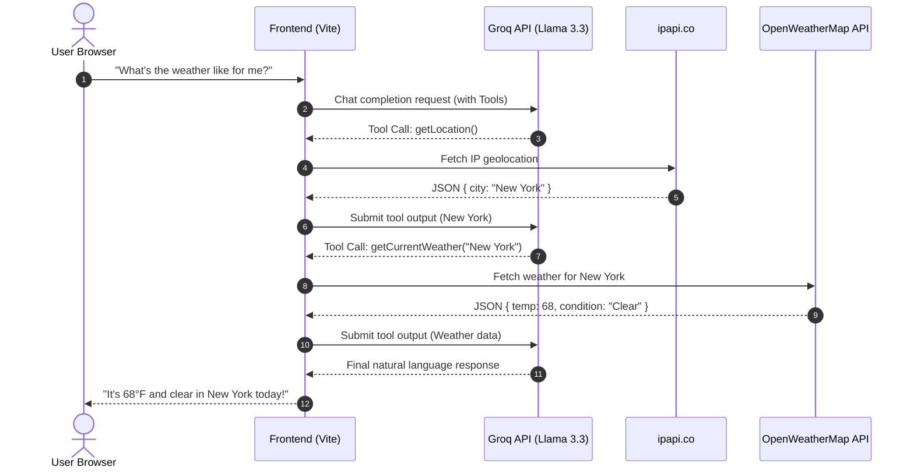

<div align="center">

# 🌤️ Contextual-Weather-Agent

### AI-Powered Conversational Weather Assistant with Function Calling

**Ask about the weather like you would a friend.**<br>
An intelligent agent that automatically determines your location and fetches real-time weather data using large language model function calling.

[](https://vitejs.dev/)
[](https://groq.com/)
[](https://llama.meta.com/)
[](https://platform.openai.com/docs/libraries)

[Features](#-features) · [Architecture](#-architecture) · [Quick Start](#-quick-start) · [How It Works](#-how-the-ai-works)

</div>

---

## 💡 The Problem

Traditional weather apps require users to manually input their city or grant explicit GPS permissions just to get a basic forecast. Furthermore, typical LLMs cannot access real-time data, often hallucinating or providing outdated weather information.

**Contextual-Weather-Agent solves this** by leveraging LLM **Function Calling**. When you ask "Do I need an umbrella today?", the agent autonomously decides to:
1. Call an IP-geolocation tool to find your city.
2. Call a weather tool to get the current forecast for that city.
3. Synthesize the raw JSON data into a natural, conversational response.

---

## ✨ Features

| Feature | Description |
|---|---|
| 🤖 **Autonomous Tool Use** | The AI dynamically decides when and how to call external APIs based on conversational context. |
| ⚡ **Blazing Fast Inference** | Powered by **Groq**'s LPU inference engine running `llama-3.3-70b-versatile` for near-instant responses. |
| 🌍 **Automatic Geolocation** | Uses `ipapi.co` to silently determine user location based on IP address — no manual input needed. |
| 🌦️ **Real-Time Data** | Integrates with the **OpenWeatherMap API** to fetch accurate, up-to-the-minute weather conditions. |
| 🗣️ **Conversational UI** | A clean, chat-based interface that turns raw weather data into engaging, natural language advice. |

---

## 🏗 Architecture



---

## 🚀 Quick Start

### Prerequisites

- **Node.js** installed
- A free **Groq API Key** → [Get it here](https://console.groq.com/keys)

### 1 · Clone & Install

```bash
git clone https://github.com/<your-username>/Contextual-Weather-Agent.git
cd Contextual-Weather-Agent
npm install
```

### 2 · Configure Environment

Create a `.env` file in the root directory:

```env
VITE_GROQ_API_KEY=your_groq_api_key_here
```

### 3 · Run the Application

Start the Vite development server:

```bash
npm run dev
```

Open the provided `http://localhost:5173` URL in your browser and start chatting!

---

## 🧠 How the AI Works

### Defining the Tools
We define JavaScript functions that fetch data, and then describe them using a specific JSON schema so the LLM knows how to use them.

```javascript
// tools.js
export const tools = [
    {
        type: "function",
        function: {
            name: "getLocation",
            description: "Get the user's current location based on their IP address"
        }
    },
    {
        type: "function",
        function: {
            name: "getCurrentWeather",
            description: "Get the current weather for a given city",
            parameters: {
                type: "object",
                properties: { location: { type: "string" } },
                required: ["location"]
            }
        }
    }
]
```

### The Magic of `runTools()`
Using the OpenAI SDK (pointed at Groq's extremely fast API endpoints), we use the `.runTools()` helper. This function automatically handles the complex back-and-forth communication required for tool calling.

```javascript
// index.js
const runner = openai.beta.chat.completions.runTools({
    model: "llama-3.3-70b-versatile",
    messages: conversationHistory,
    tools: tools // Passing our defined tools
});

const finalContent = await runner.finalContent();
```

When the user asks about the weather, the LLM realizes it lacks context. It halts text generation, requests the execution of `getLocation`, receives the city, then requests `getCurrentWeather` for that city, and *finally* generates a human-readable response summarizing the findings.

---

## 🛠 Tech Stack

| Layer | Technology | Purpose |
|---|---|---|
| **Frontend** | Vanilla JS + DOM API | Lightweight chat interface manipulation (`dom.js`) |
| **Bundler** | Vite | Lightning-fast HMR and optimized builds |
| **LLM Provider** | Groq (`llama-3.3-70b`) | Ultra-low latency inference for seamless tool calling |
| **SDK** | `openai` NPM package | Standardized API client configured with Groq's `baseURL` |
| **APIs** | OpenWeatherMap & ipapi | Real-time weather and IP-based geolocation data |

---

## 🧩 What I Learned Building This

- **LLM Tool Calling (Function Calling):** Learned how to bridge the gap between static LLM knowledge and real-time external data by strictly typing JavaScript functions using JSON Schema.
- **Agentic Workflows:** Handled multi-step reasoning where the AI must chain actions (e.g., *first* get location, *then* get weather, *then* respond).
- **Prompt Engineering for Agents:** Designed system prompts that enforce specific tool-usage behaviors ("you MUST call the getLocation tool FIRST").
- **Groq Integration:** Utilized Groq's high-speed inference engine via the standard OpenAI SDK format to achieve near-instantaneous agent responses.

---

## 📄 License

This project is open source and available under the [MIT License](LICENSE).

---

<div align="center">

**Built with ❤️ using Vite, Groq, and Llama 3.3**

*If you found this interesting, feel free to ⭐ the repo!*

</div>
